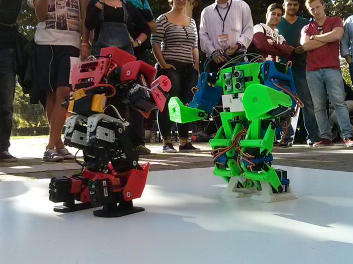

# Normativa para humanoides
La categoría de humanoides consiste en un combate no destructivo en el que compiten robots uno contra uno. Los robots compiten sobre un tatami lo suficientemente grande para que puedan desplazarse libremente por su superficie.

# Índice

 - [Robots y homologación](robots.md)
 - [Tatami](tatami.md)
 - [Combates y puntuación](combates.md)

# Atribuciones

Esta normativa se basa en el trabajo previo de otras competiciones de robots humanoides afines, tales como la [ROBO-ONE](http://www.robo-one.com/en/), [RoboGames](http://robogames.net/rules/r1-wrestling.php), [CEABOT](http://www.ceabot.es/) y [LNRC]().

# Contribuidores

 - [JavierIH](https://github.com/JavierIH)

# Recursos

- [Raider](https://github.com/JavierIH/raider)
- [MYOD](https://github.com/myod-robotics/MYOD)

# Licencia

