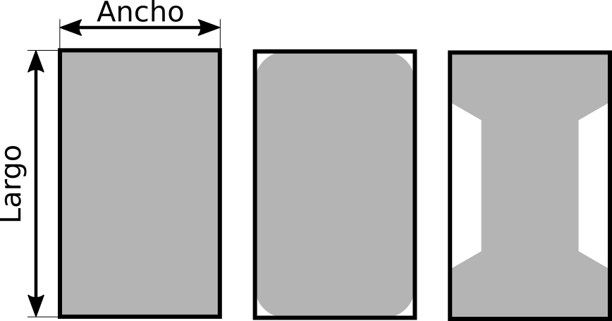

# Estructura de los robots

Los robots deben ser de tipo humanoide, lo que significa que constarán de dos brazos, dos piernas y una cabeza. Además su medio de locomoción debe estar basado en la marcha bípeda, no pudiendo ayudarse de ninguna extremidad mas allá de las patas para caminar.

## Tamaño

Para que un robot pueda homologar en la competición debe cumplir los requisitos de altura, tamaño y peso contemplados en la tabla 1.

|              | MIN | MAX |
|:------------:|:---:|:---:|
| Altura (cm)  | 20  | 50  |
| Anchura (cm) | 10  | 25  |
| Peso (kg)    | -   | 3   |

La altura del robot se medirá cuando este se encuentre en una posición erguida y totalmente estirado. La anchura del robot se medirá entre los puntos del robot donde sea máxima. En la figura 1 se muestra cómo medir la altura y anchura del robot.

La longitud de las extremidades se encontrará dentro de los valores máximos y mínimos indicados en la tabla 2. La longitud de la pierna se mide desde la parte del pie que apoya el robot en el suelo hasta el eje de la articulación de la pierna que permite el movimiento hacia adelanta y hacia atrás. La longitud de los brazos se medirá desde el eje central del robot hasta la punta de la extremidad estando éste completamente estirado.

|              | MIN | MAX |
|:------------:|:---:|:---:|
| Pierna (cm)  | 10  | 30  |
| Brazo (cm)   | 10  | 30  |

La forma correcta de medir tanto la longitud de la pierna como el brazo se encuentra representada en la figura 2.

El pie del robot tendrá un tamaño máximo limitado y dependiente de la longitud de las piernas. El largo de la superficie de apoyo del pie con el suelo tendrá un largo máximo del **50%** de la longitud de la pierna, no pudiendo superar en ningún caso **14cm**. El ancho tendrá una medida máxima del **30%** de la longitud de la pierna. La forma de la superficie del pie es libre, siempre y cuando se mantenga dentro de un rectángulo virtual de las medidas máximas.

En la figura 3 se muestran diferentes formas de pie y cómo medir su largo y ancho máximo.

Ejemplo: *un robot con unas piernas de 24cm tendrá un pie que no superará los 12cm de largo y 7.2cm de ancho. Sin embargo, un robot con unas piernas de 30cm tendrá un pie cuyas medidas no superarán 14cm de largo (aunque el 50% de la pierna sea mayor) y 9cm de ancho.*
